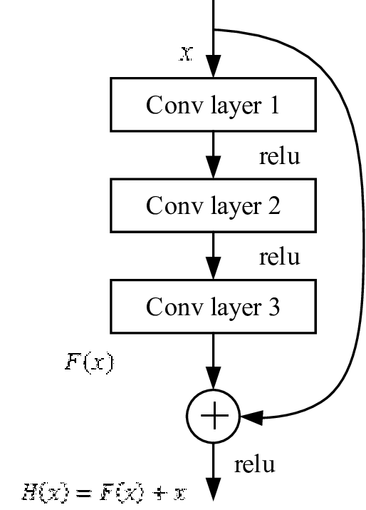
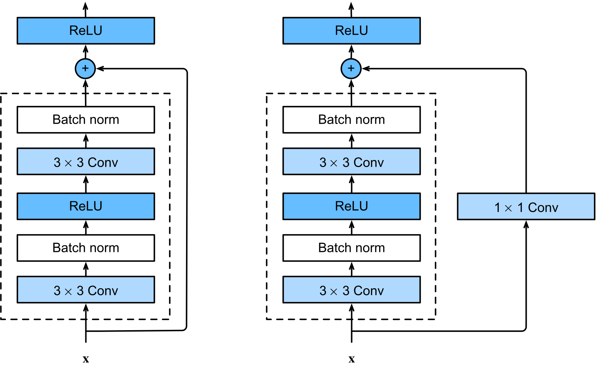

# 중-일간 산수화 분류 웹 서비스

- 남기산 일본학과 2024072924 - 일본 산수화 수집 및 웹 서비스 구축
- 김찬영 중국학과 2021023181 - 중국 산수화 수집 및 모델 학습

## I. 프로젝트 개요
동아시아의 산수화는 역사적, 문화적 특성이 다르지만 시각적으로 유사해 구분이 어렵습니다. 이를 자동으로 분류하는 작업은 예술품 분석 및 문화 콘텐츠 검색 등에 활용될 수 있습니다.  본 프로젝트는 ResNet-18 딥러닝 모델을 사용하여 중국풍 산수화와 일본풍 산수화를 구분하는 웹 서비스를 개발하는 데 목적이 있습니다.

## II. 데이터셋 구축
### 데이터 수집 및 구성
중국과 일본의 산수화 작품을 수집하여 데이터셋을 구축합니다. 
- 중국 산수화 데이터셋: [chinese-landscape-painting-dataset](https://www.kaggle.com/datasets/myzhang1029/chinese-landscape-painting-dataset)
- 일본 산수화 데이터셋: [WikiArt Dataset (Refined)](https://www.kaggle.com/datasets/trungit/wikiart30k/data?select=Ukiyo_e) (Ukiyo-e 작품 중 산수화에 해당하는 작품만 사용)
- 총 이미지 수: 클래스별 100장 수집 (train/val/test 분할, val=test로 간주)

### 디렉토리 구조
```
data/
├── train/
│   ├── cn/
│   └── jp/
├── val/
│   ├── cn/
│   └── jp/
└── test/
    ├── cn/
    └── jp/
```

### 전처리
```python
transforms.Compose([
    transforms.Resize((224, 224)),
    transforms.RandomHorizontalFlip(),
    transforms.ToTensor(),
    transforms.Normalize(mean=[0.485, 0.456, 0.406], std=[0.229, 0.224, 0.225])
])
```

## III. 모델: ResNet-18 상세 설명
본 프로젝트에서는 ResNet-18 모델을 채택하였습니다.
ResNet은 딥러닝 모델의 층이 깊어질수록 발생하는 대표적인 문제인 **기울기 소실(vanishing gradient)** 과 **성능 저하(degradation)** 문제를 해결하기 위해 제안된 구조입니다. 일반적인 신경망에서는 층이 깊어질수록 오히려 정확도가 낮아지거나 학습이 제대로 되지 않는 문제가 발생합니다. 이를 해결하기 위해 ResNet은 '잔차 연결(residual connection)', 또는 '스킵 연결(skip connection)'이라는 구조를 도입하였습니다.
이는 입력값을 몇 개의 층을 건너뛰어 그대로 출력에 더하는 방식으로, 네트워크가 '입력값 그대로를 유지할지', 아니면 '입력값에 어떤 변화를 줄지'를 스스로 선택할 수 있게 만듭니다.



수식으로는 다음과 같이 표현됩니다:
```
Output=F(x)+x
```
- F(x): 학습할 잔차 함수 (예: Conv -> BatchNorm -> ReLU)
- x: 입력 그대로 더해짐 (Identity Mapping)

이 구조 덕분에:
- 신호가 깊은 층을 거쳐도 소실되지 않고 전달되며
- 불필요한 변화 없이 기존 정보를 유지할 수 있어 학습이 더 안정적입니다.
- 역전파 시에도 두 경로를 통해 안정적으로 그래디언트가 전달되어, 깊은 네트워크에서도 학습이 원활하게 진행됩니다.

**ResNet-18 모델 구조**

ResNet-18은 다음과 같은 구조를 가집니다:
1. 입력 이미지에 대해 7×7 크기의 합성곱(Conv), 배치 정규화(BN), ReLU 활성화, 그리고 3×3 최대 풀링(MaxPooling)을 적용하여 초기 특징을 추출합니다.
2. 이후 4개의 Residual Stage를 거치며, 각 Stage는 여러 개의 Basic Block으로 구성됩니다. Basic Block은 두 개의 3×3 합성곱 층으로 이루어집니다.
3. 마지막으로 전역 평균 풀링(Global Average Pooling)과 Fully-Connected Layer를 통해 최종 출력값을 계산합니다.


**Basic Block 내부 구조**

ResNet-18에서 사용되는 Basic Block은 다음과 같습니다:
- 두 개의 3×3 합성곱(Conv), 각 뒤에 배치 정규화(BN) 및 ReLU 활성화가 붙습니다.
- 입력과 출력의 차원이 맞는 경우, 별도의 변환 없이 스킵 연결을 적용합니다.



**모델 선정 이유**

본 프로젝트에서는 비교적 경량 구조인 ResNet-18을 선택함으로써, 성능과 계산 효율 사이의 균형을 추구하였습니다. ResNet-18은 18개의 층으로 구성되어 있어 충분한 표현력을 가지면서도 과도한 연산 비용 없이 안정적으로 학습할 수 있어, 학습 데이터의 양과 프로젝트 목적에 잘 부합하는 모델입니다.


## IV. 학습 과정 
- **프레임워크**: PyTorch
- **손실 함수**: CrossEntropyLoss
- **옵티마이저**: 옵티마이저: Adam (lr=0.001)
- **하드웨어**: Vagon Computer Flame 인스턴스(like as aws ec2 g5.2xlarge, NVIDIA A10G GPU)

### 전체 흐름 개요

`sansuha_resnet18_learn.py` 파일은 전체 학습 파이프라인을 구현하고 있으며, 다음과 같은 과정을 따릅니다:

1. 데이터 로딩 및 전처리
2. 모델 초기화 및 수정 
3. 손실함수 및 옵티마이저 설정
4. 세대 반복 학습 루프 실행
5. 검증 및 최적 모델 저장
6. 학습 이력 시각화

### 데이터 로딩 및 전처리
- `torchvision.datasets.ImageFolder`를 사용하여 `train/val` 데이터를 로드.
- `transforms.Compose`로 224x224 리사이즈, 텐서 변환, 정규화를 적용.
- `DataLoader`를 통해 배치 단위 데이터 공급. 학습은 shuffle 활성화, 검증은 비활성화.
```python
transform = transforms.Compose([
    transforms.Resize((224, 224)),
    transforms.ToTensor(),
    transforms.Normalize(mean=[0.485, 0.456, 0.406], std=[0.229, 0.224, 0.225])
])
```

### 모델 초기화 및 수정
- 사전학습된 ResNet-18 모델 로드.
- 출력층을 프로젝트 목적에 맞게 2-class로 수정.
- 사전학습 weight를 활용하여 빠르고 안정적인 수렴을 유도.
```python
model = models.resnet18(weights="IMAGENET1K_V1")
model.fc = nn.Linear(model.fc.in_features, len(class_names))
```

### 손실 함수 및 옵티마이저 설정
- 손실함수: CrossEntropyLoss (다중 클래스 분류 기본)
- 옵티마이저: Adam(lr=0.001) (빠른 수렴 유도)
```python
criterion = nn.CrossEntropyLoss()
optimizer = torch.optim.Adam(model.parameters(), lr=0.001)
```

### 세대 반복 학습 루프
- 총 10 epoch 동안 반복.
- 각 epoch마다 학습/검증 순서로 구성.
- 학습 단계에서는 파라미터 갱신, 검증 단계에서는 검증 성능 기록.
- 가장 높은 검증 정확도 도달 시 모델 파라미터 저장.
```python
for epoch in range(10):
    model.train()
    for inputs, labels in train_loader:
        optimizer.zero_grad()
        loss = criterion(model(inputs), labels)
        loss.backward()
        optimizer.step()

    model.eval()
    with torch.no_grad():
        for inputs, labels in val_loader:
            ...
```

### 최적 모델 저장 로직
- 검증 정확도가 best_acc 보다 높을 경우 체크포인트 저장.
- torch.save()로 모델 가중치, 옵티마이저 상태, epoch 정보 기록.
```python
if val_accuracies[-1] > best_acc:
    best_acc = val_accuracies[-1]
    torch.save({
        'epoch': epoch + 1,
        'model_state_dict': model.state_dict(),
        'optimizer_state_dict': optimizer.state_dict(),
        'val_accuracy': val_accuracies[-1]
    }, "best_model.pth")
```
### 학습 이력 시각화


- train_losses, val_losses, val_accuracies 리스트로 기록.
- matplotlib로 학습 과정의 손실 및 정확도 그래프 작성.
- 출력 파일: loss_accuracy.png
```python
plt.figure()
plt.plot(train_losses, label='Train Loss')
plt.plot(val_losses, label='Val Loss')
plt.plot(val_accuracies, label='Val Accuracy')
plt.legend()
plt.title("Loss & Accuracy")
plt.savefig("loss_accuracy.png")
```

## V. 분석 및 시각화

### 1. 혼동 행렬 (Confusion Matrix)


모델이 클래스마다 얼마나 정확히 예측했는지 시각적으로 보여줍니다. 혼동 행렬은 실제 클래스와 예측 클래스의 교차표로, 대각선 성분이 올바른 예측 횟수입니다. 이 행렬을 통해 어떤 클래스들이 서로 혼동되는지 쉽게 파악할 수 있습니다.
- confusion_matrix_loaded.png 생성
- 클래스별 오분류 패턴 확인

### 2. 분류 리포트
```
Using device: cuda
              precision    recall  f1-score   support

       china       0.91      1.00      0.95        20
       japan       1.00      0.90      0.95        20

    accuracy                           0.95        40
   macro avg       0.95      0.95      0.95        40
weighted avg       0.95      0.95      0.95        40
```
Precision(정밀도), Recall(재현율), F1-score 등의 지표를 클래스별로 계산하여 모델 성능을 평가합니다. Scikit-learn의 classification_report 함수를 통해 각 클래스별 지표를 출력하고, 모델이 특정 클래스에서 편향적으로 예측하지는 않는지 확인합니다.
- Precision, Recall, F1-score 등 주요 성능 지표 산출
- classification_report 출력

### 3. Grad-CAM

**중국 산수화 예시**

**일본 산수화 예시**


Grad-CAM(Gradient-weighted Class Activation Mapping) 기법을 사용하여 모델이 이미지의 어떤 영역을 집중하는지 분석했습니다. Grad-CAM은 분류 결과에 기여하는 이미지의 중요한 영역을 히트맵 형태로 강조해 주는 방법으로, 마지막 합성곱 계층의 그라디언트 정보를 사용합니다. 예를 들어 모델이 ‘중국화’로 예측한 이미지에 대해 Grad-CAM을 적용하면, 모델이 산과 나무의 특정 부분, 혹은 붓터치와 같은 특징적인 요소를 근거로 삼았는지 확인할 수 있습니다.
- 모델이 예측 시 주목한 이미지 영역 시각화
- gradcam_result_cn.png, gradcam_result_jp.png 생성

### 4. t-SNE 시각화


테스트 세트의 이미지들을 ResNet-18의 마지막 전 결합층 직전의 고차원 특징 벡터(feature vector)로 추출한 뒤, 이를 2차원으로 축소하여 시각화했습니다. t-SNE는 고차원 데이터를 2D/3D로 비선형 임베딩하여 클래스별 군집 구조를 시각적으로 파악할 수 있게 도와줍니다. 이를 통해 중국화와 일본화 이미지가 임베딩 공간에서 어떻게 분리되는지 확인할 수 있습니다.
- 고차원 feature embedding을 2D로 축소하여 시각화
- tsne_loaded.png 생성

## VI. 결과 요약 및 한계점

**correct 예시**

**wrong 예시**


- 최종 검증 정확도: 약 92% (best_model.pth 기준)
- Grad-CAM 및 t-SNE 분석을 통해 모델이 특징적인 시각 패턴을 잘 학습했음을 확인함
- 일부 유사 이미지 간 오분류 존재 (예: 구름, 산의 표현이 비슷한 경우)

### 향후 개선 방향
- 데이터셋 추가 확보 (특히 한국 산수화 포함 가능성)
- ResNet-50, EfficientNet 등 다양한 아키텍처 실험
- 앙상블 모델 적용
- 모델 경량화 및 실시간 추론 최적화


## VII. 참고 및 부록
### 사용 주요 라이브러리 
- torch, torchvision, sklearn, seaborn, matplotlib, cv2, PIL 등

### 코드 파일
- `sansuha_resnet18_learn.py`: 전체 학습 파이프라인 구현
- `sansuha_resnet18_analyze.py`: 분석 및 시각화 도구 구현

